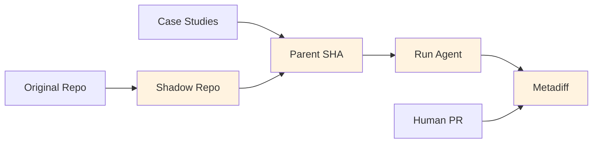

# Explanation

Explanation sections are **understanding-oriented** - they provide background, context, and rationale to help you develop a deeper understanding of SCRIBE's design and capabilities.

## Foundational concepts

| Topic | Description |
|-------|-------------|
| [Why SCRIBE?](why-scribe.md) | The problem SCRIBE solves and the AI4Curation vision |
| [Shadow repos](shadow-repos.md) | Why shadow repositories enable reproducible evaluation |

## The two pipelines

SCRIBE supports two complementary workflows:

### Case Study Curation

```mermaid
graph LR
    GH[GitHub Repo] --> SKILL[/find-training-cases]
    SKILL --> CS[Case Study Files]
    CS --> VAL[Validate]
    VAL --> READY[Ready for Eval]

    style SKILL fill:#e1f5fe
    style CS fill:#e1f5fe
    style VAL fill:#e1f5fe
```

**Purpose**: Curate diverse, high-quality case studies for agent evaluation.

**Key insight**: An AI agent with judgment selects better training cases than deterministic heuristics. The agent can assess difficulty, identify diverse task types, and write rich context notes.

### Agent Evaluation Pipeline



**Purpose**: Systematically evaluate AI coding agents against real-world tasks.

**Key insight**: GitHub issues with merged PRs provide ground truth. By resetting to the commit state before the PR (the parent SHA recorded in the case study), agents face the same challenge as human developers.

## Design philosophy

### Agentic curation over deterministic extraction

SCRIBE originally used a deterministic pipeline (`extract -> create-review-cases -> distill`). This was replaced by agentic curation because:

- Agents can assess case quality holistically
- Agents select for diversity across task types and difficulty
- Agents write useful context that aids evaluation interpretation
- The resulting case studies are validated against a LinkML schema

### CLI-first

SCRIBE prioritizes command-line workflows:

- Integrates with existing tools (`gh`, `git`, shell scripts)
- Easy to automate and script
- Works in CI/CD pipelines
- Python API available but secondary

### Reproducible evaluation

Agent evaluations are designed for reproducibility:

- Versioned agent configurations (`agent_config_tag`)
- Case studies record the exact parent SHA for checkout
- Full execution traces (artifacts)
- Metadiff provides objective comparison metrics

## AI4Curation context

SCRIBE is part of the [AI4Curation](https://github.com/ai4curation) initiative, which explores how AI can assist with knowledge curation in:

- Biomedical ontologies (Gene Ontology, Mondo, Uberon)
- Knowledge graphs (Monarch Initiative)
- Scientific databases

The initiative recognizes that:

1. **Curation is bottlenecked by human time** - AI can accelerate routine tasks
2. **Domain expertise is irreplaceable** - AI should augment, not replace, expert judgment
3. **Quality matters** - Systematic evaluation is essential before deploying AI in curation workflows

SCRIBE provides the infrastructure for that evaluation.

## Further reading

- [AI4Curation Documentation](https://ai4curation.github.io/aidocs/)
- [Chris Mungall on Knowledge Graphs and AI](https://knowledgegraphinsights.com/chris-mungall/)
- [Tutorials](../tutorials/index.md) for hands-on learning
- [Reference](../reference/index.md) for technical details
