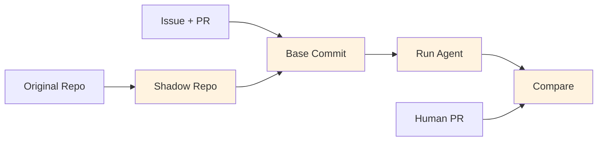

# Explanation

Explanation sections are **understanding-oriented** - they provide background, context, and rationale to help you develop a deeper understanding of SCRIBE's design and capabilities.

## Foundational concepts

| Topic | Description |
|-------|-------------|
| [Why SCRIBE?](why-scribe.md) | The problem SCRIBE solves and the AI4Curation vision |
| [Shadow repos](shadow-repos.md) | Why shadow repositories enable reproducible evaluation |

## Data pipeline

| Topic | Description |
|-------|-------------|
| [PR categories](pr-categories.md) | How PRs are classified (merged_no_mods, merged_with_mods, etc.) |
| [Data model](data-model.md) | Structure of extracted PR data |
| [Review cases](review-cases.md) | The "first revision" concept for training data |
| [Distillation](distillation.md) | AI-powered refinement of training data |

## The two pipelines

SCRIBE supports two complementary workflows:

### Training Data Pipeline


**Purpose**: Create datasets for training and evaluating LLM code reviewers.

**Key insight**: Mature repositories contain years of human expertise encoded in PR reviews and discussions. SCRIBE extracts this knowledge as structured training data.

### Agent Evaluation Pipeline



**Purpose**: Systematically evaluate AI coding agents against real-world tasks.

**Key insight**: GitHub issues with merged PRs provide ground truth. By resetting to the commit state before the PR, agents face the same challenge as human developers.

## Design philosophy

### CLI-first

SCRIBE prioritizes command-line workflows:

- Integrates with existing tools (`gh`, `git`, shell scripts)
- Easy to automate and script
- Works in CI/CD pipelines
- Python API available but secondary

### Rich context preservation

All extracted data maintains relationships:

```python
# Not just strings
review_bodies = ["Fix the typo"]  # ❌ Loses context

# Full context
reviews = [{
    "author": "reviewer",
    "state": "CHANGES_REQUESTED",
    "body": "Fix the typo",
    "submitted_at": "2024-08-29T00:10:43Z",
    "commit_id": "abc123"  # Which commit was reviewed
}]  # ✅ Preserves relationships
```

### Explicit caching

API responses are cached in a structured, inspectable format:

```
.ai4cscribe/cache/
└── owner/
    └── repo/
        ├── pr/1234/
        │   ├── pr_data.json
        │   ├── reviews.json
        │   └── commits_detailed_raw.json
        └── issue/5678/
            └── issue_data.json
```

Benefits:
- Fast repeated extractions
- Reproducible results
- Inspectable for debugging
- No external dependencies

### Reproducible evaluation

Agent evaluations are designed for reproducibility:

- Versioned agent configurations (`agent_config_tag`)
- Iteration tracking (`iter_num`)
- Full execution traces (artifacts)
- Deterministic commit reset

## AI4Curation context

SCRIBE is part of the [AI4Curation](https://github.com/ai4curation) initiative, which explores how AI can assist with knowledge curation in:

- Biomedical ontologies (Gene Ontology, Mondo, Uberon)
- Knowledge graphs (Monarch Initiative)
- Scientific databases

The initiative recognizes that:

1. **Curation is bottlenecked by human time** - AI can accelerate routine tasks
2. **Domain expertise is irreplaceable** - AI should augment, not replace, expert judgment
3. **Quality matters** - Systematic evaluation is essential before deploying AI in curation workflows

SCRIBE provides the infrastructure for that evaluation.

## Further reading

- [AI4Curation Documentation](https://ai4curation.github.io/aidocs/)
- [Chris Mungall on Knowledge Graphs and AI](https://knowledgegraphinsights.com/chris-mungall/)
- [Tutorials](../tutorials/index.md) for hands-on learning
- [Reference](../reference/index.md) for technical details
