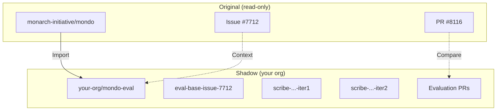
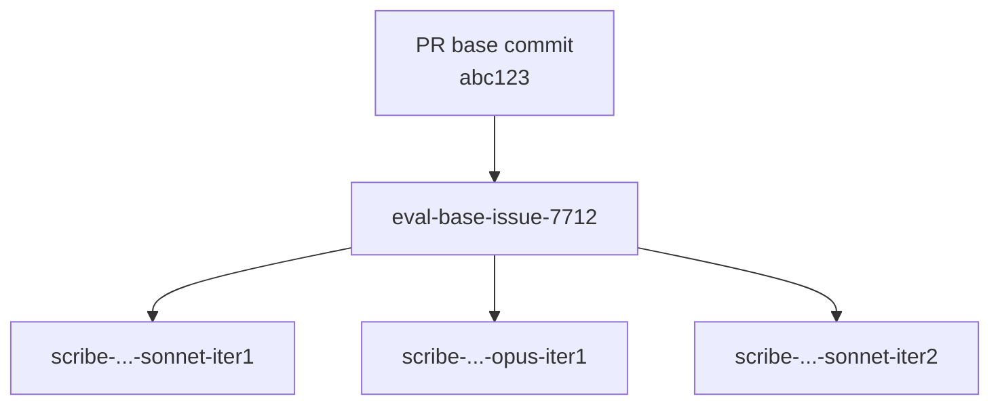

# Shadow repositories

Shadow repositories are copies of the original repository used for running agent evaluations. This page explains why they're necessary and how they enable reproducible, at-scale testing.

## The problem with evaluating in place

Consider what happens if you run agent evaluations directly in a production repository:

```
main-branch
├── feature-pr-123
├── bugfix-pr-456
├── scribe-eval-issue-789-run1     ← Evaluation branch
├── scribe-eval-issue-789-run2     ← Another run
├── scribe-eval-issue-790-run1     ← Different issue
└── ... hundreds of experiment branches
```

Problems:

1. **Branch pollution**: Experiment branches clutter the repository
2. **PR noise**: Evaluation PRs mix with real PRs
3. **Permission issues**: You may not have write access to the original
4. **History confusion**: Which branches are experiments vs. real work?

## The shadow repo solution

Instead, create a separate repository for evaluations:



Benefits:

- Original repository stays clean
- Full control over experiment branches
- Can test on repos you don't own
- Private evaluation of public repos

## How imports work

GitHub's repository import creates a **standalone copy** with the same commit history:

```bash
# Original repo has commits:
abc123 → def456 → ghi789 → jkl012 → main

# After import, shadow repo has identical history:
abc123 → def456 → ghi789 → jkl012 → main  # Same SHAs!
```

This is crucial because SCRIBE needs to checkout at historical commits (the base commit of the original PR). Since commit SHAs are preserved, the same checkout command works in the shadow repo.

!!! warning "Forks vs imports"
    **Don't use forks.** Forks maintain a relationship with the upstream repository that:

    - Restricts certain GitHub Actions behaviors
    - Makes PRs default to targeting upstream
    - Can cause permission complications

    **Use imports.** They create fully independent copies.

## The three-repo architecture

SCRIBE's evaluation workflow can involve up to three repositories:

| Repository | Role | Example |
|------------|------|---------|
| **Issue repo** | Source of issues and ground-truth PRs | `monarch-initiative/mondo` |
| **Workflow repo** | Where evaluations run, branches created | `your-org/mondo-eval` |
| **Agent config repo** | Contains CLAUDE.md and agent instructions | `your-org/mondo-agent` |

### Deployment scenarios

**Scenario 1: Simple (single repo)**

All three roles in one repository. Good for quick testing on repos you own.

```
your-org/repo
├── Issues
├── Evaluation workflow
└── Agent config (CLAUDE.md)
```

**Scenario 2: Separate config**

Agent configuration in its own repo for reuse across projects.

```
your-org/repo        → Issues + Workflow
your-org/agent       → Agent config
```

**Scenario 3: Full separation (recommended)**

Complete isolation for evaluating external repositories.

```
original-org/repo    → Issue context (read-only)
your-org/repo-eval   → Workflow + experiment branches
your-org/agent       → Agent config
```

## Eval-base branches

The workflow creates `eval-base-issue-NNN` branches that serve as merge targets:



**Why not target `main`?**

The original PR was based on a historical commit, not current `main`. If we targeted `main`:

1. Agent would face merge conflicts from subsequent changes
2. Diff comparison would include unrelated changes
3. Evaluation wouldn't reflect the original task

By targeting `eval-base-issue-NNN`, the diff shows only agent changes.

## Branch naming

Experiment branches encode their configuration:

```
scribe-v1-yourorg-mondo-agent-v1.0.0-.-claude-sonnet-4-5-20250929-iter1-issue-7712
       │   │                   │     │  │                        │    └─ Issue
       │   │                   │     │  │                        └─ Iteration
       │   │                   │     │  └─ Model
       │   │                   │     └─ Config directory
       │   │                   └─ Config tag
       │   └─ Config repo
       └─ SCRIBE version
```

This enables:

- Finding branches by configuration
- Tracking multiple iterations
- Comparing results across models

## Reproducibility guarantees

SCRIBE ensures evaluations are reproducible:

### Same starting point

```bash
# Checkout at exact base commit
git checkout <pr-base-sha>
```

The agent starts from the identical repository state as the human developer.

### Versioned configuration

```yaml
agent_config_repo: your-org/mondo-agent
agent_config_tag: v1.0.0  # Not "latest"!
```

Using tags (not branches) ensures the same instructions every time.

### Iteration tracking

```yaml
iter_num: 1  # First run
iter_num: 2  # Second run with same config
```

Multiple runs with the same config get unique branches.

### Execution traces

Every run produces artifacts:

- `claude-response-{run_id}.json` - Full execution trace
- `issue-context-{run_id}.json` - Input to agent
- `run-metadata-{run_id}.json` - Configuration snapshot

## Comparing results

After evaluation, compare agent vs human:

```bash
# Agent's changes
git diff eval-base-issue-7712..scribe-...-issue-7712 > agent.diff

# Human's changes (from original PR)
git diff <base-sha>..<pr-head-sha> > human.diff

# Compare
ai4c-scribe metadiff compare human.diff agent.diff
```

Metrics available:

- **Similarity**: Jaccard similarity of changed lines
- **Precision**: What fraction of agent changes were correct
- **Recall**: What fraction of needed changes did agent make
- **F1**: Harmonic mean of precision and recall

## Privacy considerations

Shadow repos can be private even when the original is public:

- Run evaluations privately
- Keep experiment results confidential
- Control who sees agent performance

The workflow reads public information (issues, PRs) but writes only to your shadow repo.

## Related

- [Tutorial](../tutorial.md) -- End-to-end walkthrough
- [Workflow reference](../reference/workflow.md) -- Workflow inputs and outputs
- [How to add a new repo](../how-to/add-new-repo.md) -- Setting up a new shadow repo
