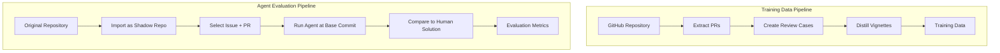

# SCRIBE

**Social Coding Repository artificial Intelligence Benchmarking and Evaluation**

SCRIBE helps teams evaluate and improve AI coding agents by mining GitHub repositories for training data and running systematic evaluations at scale.

Part of the [AI4Curation](https://github.com/ai4curation) initiative for integrating AI into knowledge curation workflows.

## Who is SCRIBE for?

SCRIBE is designed for teams that:

- **Maintain GitHub-based repositories** (code, ontologies, knowledge bases, documentation)
- **Want to evaluate AI coding agents** systematically against real-world tasks
- **Need training data** from historical PRs and code reviews
- **Run projects with established review processes** that contain valuable institutional knowledge

Common use cases include ontology development teams (OBO Foundry projects), open-source maintainers, and research groups using GitHub for collaborative knowledge engineering.

## Two Core Capabilities

### 1. Training Data Extraction

Mine your repository's "pre-AI" history to extract high-quality training and evaluation datasets:

```bash
# Extract PRs with rich context (commits, reviews, linked issues)
ai4c-scribe extract monarch-initiative/mondo -o prs.jsonl -l 100

# Create review cases for LLM training
ai4c-scribe create-review-cases prs.jsonl -o review-cases.jsonl

# Distill into curated vignettes with AI
ai4c-scribe distill review-cases.jsonl -o vignettes/
```

**What you get:**

- Complete PR metadata with commit history and diffs
- Code review feedback linked to specific changes
- Issue discussions that motivated each PR
- Categorized PRs (merged as-is, merged with modifications, abandoned)
- AI-refined vignettes rated for clarity and difficulty

### 2. Agent Evaluation at Scale

Use "shadow repositories" to evaluate AI agents against known-good human solutions:

```bash
# Run agent evaluation via GitHub Actions workflow
gh workflow run eval-agent-on-issue \
  --field issue_repo=monarch-initiative/mondo \
  --field issue_number=7712 \
  --field pr_number=8116 \
  --field agent_config_repo=my-org/mondo-agent \
  --field agent_config_tag=v1.0.0 \
  --field model=claude-sonnet-4-5-20250929 \
  --field create_pr=true
```

**How it works:**

1. **Import** the target repository as a "shadow repo" in your organization
2. **Select issues** with known merged PRs as ground truth
3. **Run agents** from the exact commit state before the original PR
4. **Compare** agent solutions against human solutions
5. **Iterate** on agent configurations and prompts

This approach keeps the original repository clean while enabling systematic, reproducible evaluation.

## Quick Start

### Installation

```bash
# Install from PyPI
pip install ai4c-scribe

# Or with uv (recommended)
uv pip install ai4c-scribe

# Verify installation
ai4c-scribe --help
```

**Requirements:**

- Python 3.11+
- [GitHub CLI (gh)](https://cli.github.com/) authenticated with `gh auth login`

### Extract Your First PR Dataset

```bash
# Extract 10 merged PRs from any GitHub repository
ai4c-scribe extract owner/repo -o my-prs.jsonl -l 10

# View extraction summary
head -1 my-prs.jsonl | jq '.pr_number, .category, .commits.total_commits'
```

See the [tutorials](tutorials/index.md) for complete walkthroughs.

## Documentation

<div class="grid cards" markdown>

-   :material-school:{ .lg .middle } **Tutorials**

    ---

    Step-by-step guides from installation to running evaluations

    [:octicons-arrow-right-24: Get started](tutorials/index.md)

-   :material-tools:{ .lg .middle } **How-to guides**

    ---

    Task-focused guides for specific operations

    [:octicons-arrow-right-24: How-to guides](how-to/index.md)

-   :material-book-open-variant:{ .lg .middle } **Explanation**

    ---

    Background concepts, design decisions, and rationale

    [:octicons-arrow-right-24: Concepts](explanation/index.md)

-   :material-file-code:{ .lg .middle } **Reference**

    ---

    CLI commands, GitHub workflows, and data structures

    [:octicons-arrow-right-24: Reference](reference/index.md)

</div>

## The SCRIBE Pipeline



## Background

SCRIBE emerged from the [AI4Curation](https://github.com/ai4curation) project, which explores how AI can assist with knowledge curation in biomedical ontologies and knowledge graphs.

Key insights driving SCRIBE's design:

- **GitHub history is valuable training data.** Mature repositories have extensive PR history with reviews, discussions, and iterative refinements that encode institutional knowledge.

- **Reproducible evaluation requires careful setup.** Agents must start from the same commit state as human developers to enable fair comparison.

- **Shadow repos keep originals clean.** Running evaluations on imported copies avoids polluting production repositories with experiment branches.

- **CLI-first design.** SCRIBE prioritizes command-line workflows that integrate with existing GitHub tooling and automation.

For more on the AI4Curation vision, see:

- [AI4Curation Documentation](https://ai4curation.github.io/aidocs/)
- [Chris Mungall on Knowledge Graphs and AI](https://knowledgegraphinsights.com/chris-mungall/)

## Links

- [GitHub Repository](https://github.com/ai4curation/ai4c-scribe)
- [Issue Tracker](https://github.com/ai4curation/ai4c-scribe/issues)
- [AI4Curation Organization](https://github.com/ai4curation)
