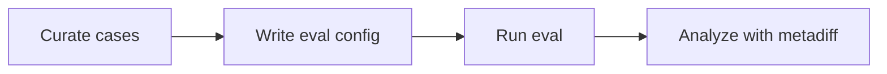

# SCRIBE

**Social Coding Repository artificial Intelligence Benchmarking and Evaluation**

SCRIBE evaluates AI coding agents by replaying real GitHub issues against shadow repositories and comparing agent output to human solutions.

## What SCRIBE does

1. **Curates case studies** from real issue/PR pairs as markdown files with YAML frontmatter
2. **Runs agents** (Claude Code or Codex) against those cases via GitHub Actions
3. **Scores results** using metadiff (F1, precision, recall) against the human solution

## Quick start

```bash
# Install
uv pip install ai4c-scribe

# Validate existing case studies
ai4c-scribe cases validate examples/cases/go-ontology/

# Run an eval batch
ai4c-scribe workflows run examples/configs/go-ontology-eval.yaml
```

**Requirements:** Python 3.11+, [GitHub CLI](https://cli.github.com/) authenticated, access to a shadow repo with the `eval-agent-on-issue.yml` workflow deployed.

## The pipeline at a glance



Each step is covered in the [Tutorial](tutorial.md).

## Real results: GO ontology eval (Codex gpt-5.4)

| Case | Task | Difficulty | F1 |
|------|------|-----------|-----|
| #31961 | obsoletion | simple | 1.000 |
| #30894 | new term | medium | 0.778 |
| #31967 | CYP450 reparent | medium | 0.800 |
| #31969 | oxidoreductase | hard | 0.929 |
| #31670 | taxon constraints | hard | 0.000 |

Agents excel at mechanical tasks but struggle with multi-file changes requiring deep domain knowledge.

## Documentation

- [Tutorial](tutorial.md) -- End-to-end walkthrough using the GO ontology
- [How-to guides](how-to/index.md) -- Task-focused recipes
- [Explanation](explanation/index.md) -- Background concepts
- [Reference](reference/index.md) -- CLI, workflow inputs, schema, metadiff

## Links

- [GitHub Repository](https://github.com/ai4curation/ai4c-scribe)
- [AI4Curation Organization](https://github.com/ai4curation)
