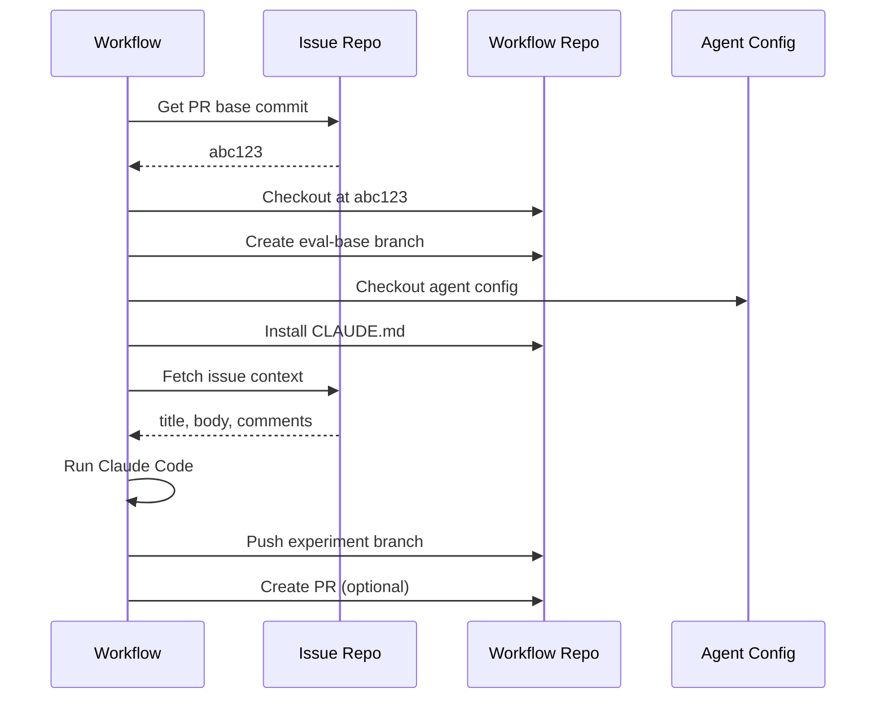

# GitHub Workflows Reference

SCRIBE provides reusable GitHub Actions workflows for running agent evaluations at scale.

## eval-agent-on-issue

The primary evaluation workflow. Runs an AI agent against a historical issue and compares its solution to the human-authored PR.

### Inputs

| Input | Required | Default | Description |
|-------|----------|---------|-------------|
| `issue_repo` | No | Current repo | Repository containing the issue (owner/repo) |
| `issue_number` | **Yes** | - | Issue number to solve |
| `pr_number` | **Yes** | - | PR number (determines base commit) |
| `agent_config_repo` | No | Current repo | Repository containing agent config |
| `agent_config_tag` | **Yes** | - | Tag/branch of agent config |
| `agent_config_directory` | No | `.` | Directory within config repo |
| `model` | **Yes** | - | Claude model to use |
| `force_new_branch` | No | `false` | Force push if branch exists |
| `create_pr` | No | `false` | Create evaluation PR |
| `iter_num` | No | `1` | Iteration number |
| `repo_url_prefix` | No | `https://href.li/?` | URL prefix for links |
| `container` | No | - | Docker container image |
| `uv_tool_install` | No | - | Additional tools to install |
| `validation_command` | No | - | Command to validate changes |
| `artifact_retention_days` | No | `90` | Days to retain artifacts |
| `timeout_minutes` | No | `30` | Job timeout |

### Available models

**Current (4.5):**
- `claude-sonnet-4-5-20250929`
- `claude-haiku-4-5-20251001`
- `claude-opus-4-5-20251101`

**Legacy (4.x):**
- `claude-opus-4-1-20250805`
- `claude-sonnet-4-20250514`
- `claude-opus-4-20250514`

**Legacy (3.x):**
- `claude-3-7-sonnet-20250219`
- `claude-3-haiku-20240307`

### Required secrets

| Secret | Description |
|--------|-------------|
| `ANTHROPIC_API_KEY` | Anthropic API key |
| `CLAUDE_CODE_OAUTH_TOKEN` | Alternative: Claude Code OAuth token |

At least one of `ANTHROPIC_API_KEY` or `CLAUDE_CODE_OAUTH_TOKEN` must be set.

### Optional secrets

| Secret | When needed |
|--------|-------------|
| `GH_PAT` | Accessing private repos across organizations |

### Outputs

| Artifact | Description |
|----------|-------------|
| `claude-response-{run_id}` | Full Claude execution trace |
| `issue-context-{run_id}` | Issue context JSON |
| `run-metadata-{run_id}` | Run configuration snapshot |
| `issue-comments-{run_id}` | Agent's issue comments (if created) |
| `pr-comments-{run_id}` | Agent's PR comments (if created) |

### Branch naming

```
scribe-{VERSION}-{config_repo}-{tag}-{directory}-{model}-iter{N}-issue-{N}
```

Example:
```
scribe-v1-myorg-mondo-agent-v1.0.0-.-claude-sonnet-4-5-20250929-iter1-issue-7712
```

### Usage example

```bash
gh workflow run eval-agent-on-issue \
  --repo your-org/mondo-eval \
  --field issue_repo=monarch-initiative/mondo \
  --field issue_number=7712 \
  --field pr_number=8116 \
  --field agent_config_repo=your-org/mondo-agent \
  --field agent_config_tag=v1.0.0 \
  --field model=claude-sonnet-4-5-20250929 \
  --field create_pr=true
```

### Workflow diagram



---

## ai-agent-mentions

Responds to `@agent-name please <request>` mentions in issues and PRs.

### Trigger

- Issue opened/edited
- Issue comment created/edited
- PR opened/edited
- PR review comment created/edited

### Configuration

Create `.github/ai-controllers.json` with authorized users:

```json
["username1", "username2"]
```

### Environment variables

| Variable | Default | Description |
|----------|---------|-------------|
| `AGENT_NAME` | `dragon-ai-agent` | Name for @mentions |
| `MODEL` | `claude-opus-4-5-20251101` | Claude model |
| `TIMEOUT_MINUTES` | `30` | Job timeout |
| `ARTIFACT_RETENTION_DAYS` | `90` | Artifact retention |

### Required secrets

| Secret | Description |
|--------|-------------|
| `ANTHROPIC_API_KEY` | Anthropic API key |
| `PAT_FOR_PR` | PAT with repo and PR permissions |

### Usage

In any issue or PR comment:

```
@dragon-ai-agent please add a new term for "example disease" with
appropriate cross-references to DOID and OMIM
```

The agent will:

1. Add 👀 reaction immediately
2. Post "Working on it..." comment
3. Read context via `gh` CLI
4. Make changes and create PR
5. Post results as comment

### SKIP_ODK mode

Include `SKIP_ODK` or `quick question` in your message to run without the ODK container:

```
@dragon-ai-agent please explain what cross-references exist for MONDO:0001234 (quick question)
```

---

## fix-issue

Simpler workflow for running agent on an issue. Less configurable than `eval-agent-on-issue`.

### Inputs

| Input | Required | Description |
|-------|----------|-------------|
| `issue_number` | **Yes** | Issue to fix |
| `pr_number` | **Yes** | Reference PR |
| `model` | **Yes** | Claude model |

### Usage

```bash
gh workflow run fix-issue \
  --field issue_number=123 \
  --field pr_number=456 \
  --field model=claude-sonnet-4-5-20250929
```

---

## Agent configuration templates

Agent config templates tell Claude Code how to approach tasks.

### Required structure

```
my-agent-config/
├── justfile              # Required: must have `install` recipe
├── copier.yaml           # Optional: copier configuration
└── template/
    ├── CLAUDE.md         # Agent instructions
    └── .claude/          # Optional: Claude settings
        └── settings.json
```

### justfile requirements

```just
AGENT_FILES := "CLAUDE.md AGENTS.md .claude"

[no-cd]
pre_clean target-directory=".":
    cd {{target-directory}} && rm -rf {{AGENT_FILES}}

[no-cd]
install target-directory=".": (pre_clean target-directory)
    copier copy -f {{ justfile_directory() }}/template {{ target-directory }}
```

Key points:

- `[no-cd]` attribute runs recipes in caller's directory
- `{{ justfile_directory() }}` refers to template location
- `install` takes optional `target-directory` argument

### CLAUDE.md example

```markdown
# Agent Instructions

You are solving issues in the Mondo disease ontology repository.

## Task Guidelines

1. Read issue context from `__issue_context__.json`
2. Follow OBO Foundry conventions
3. Make minimal, focused changes
4. Commit with clear messages

## Domain Knowledge

- Terms use MONDO: prefix
- Cross-references should use exact match
- New terms require definition and synonym
```

### Versioning

Use git tags for reproducibility:

```bash
git tag v1.0.0
git push origin v1.0.0
```

Reference in workflow:

```yaml
agent_config_tag: v1.0.0  # Not "main" or "latest"
```

---

## Protecting eval-base branches

Protect baseline branches from modification:

1. Settings → Branches → Add rule
2. Pattern: `eval-base-*`
3. Enable:
   - Require pull request before merging
   - Require 1 approval
   - Disable force pushes
   - Disable deletions

---

## Downloading workflow files

```bash
# Download all SCRIBE workflows
curl -o .github/workflows/eval-agent-on-issue.yml \
  https://raw.githubusercontent.com/ai4curation/ai4c-scribe/main/workflows/eval-agent-on-issue.yml

curl -o .github/workflows/ai-agent-mentions.yml \
  https://raw.githubusercontent.com/ai4curation/ai4c-scribe/main/workflows/ai-agent-mentions.yml

curl -o .github/workflows/fix-issue.yml \
  https://raw.githubusercontent.com/ai4curation/ai4c-scribe/main/workflows/fix-issue.yml
```
