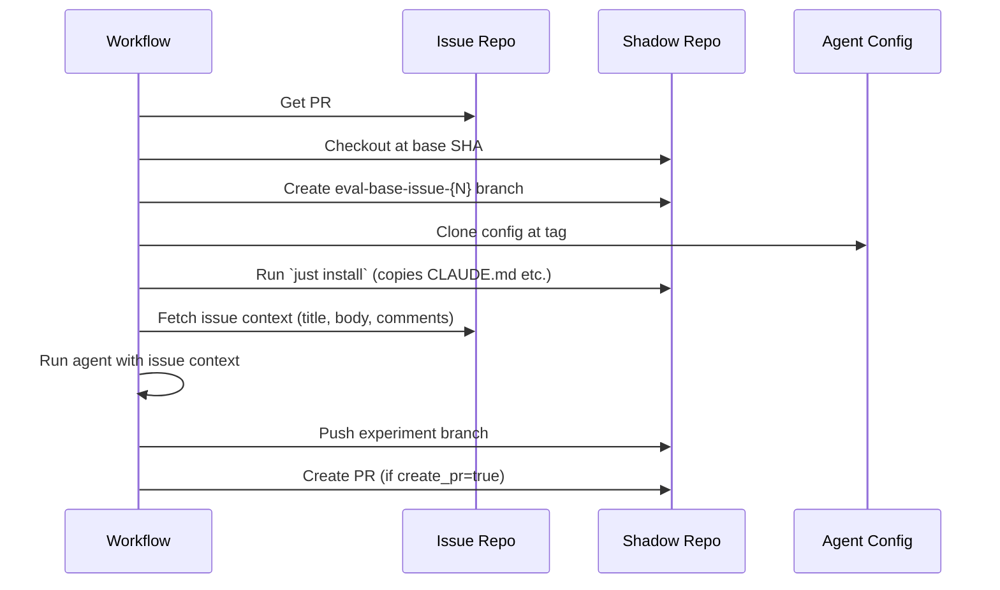

# Workflow reference: eval-agent-on-issue.yml

The `eval-agent-on-issue.yml` workflow is the core evaluation engine. Deploy it to your shadow repo and trigger it via the CLI or `gh workflow run`.

## Inputs

| Input | Required | Default | Description |
|-------|----------|---------|-------------|
| `issue_repo` | No | Current repo | Repository containing the issue (`owner/repo`) |
| `issue_number` | Yes | -- | Issue number to solve |
| `pr_number` | Yes | -- | PR number (determines base commit for checkout) |
| `agent_config_repo` | No | Current repo | Repository containing agent config |
| `agent_config_tag` | Yes | -- | Tag/branch of agent config to use |
| `agent_config_directory` | No | `.` | Directory within config repo |
| `model` | Yes | -- | Model identifier (see below) |
| `agent_runtime` | No | `claude` | Agent runtime: `claude` or `codex` |
| `create_pr` | No | `false` | Create a PR from agent changes |
| `force_new_branch` | No | `false` | Force push if branch already exists |
| `iter_num` | No | `1` | Iteration number (for repeated runs) |
| `container` | No | -- | Docker container image (e.g., `obolibrary/odkfull:latest`) |
| `uv_tool_install` | No | -- | Additional tools to install via `uv tool install` |
| `validation_command` | No | -- | Command to validate agent changes |
| `timeout_minutes` | No | `30` | Job timeout |
| `artifact_retention_days` | No | `90` | Days to retain run artifacts |

## Supported models

**Claude (agent_runtime: claude):**

- `claude-sonnet-4-5-20250929`
- `claude-opus-4-5-20251101`
- `claude-haiku-4-5-20251001`

**OpenAI (agent_runtime: codex):**

- `gpt-5.4`
- `o3`

## Required secrets

Set these in the shadow repo's Settings > Secrets:

| Secret | When needed |
|--------|-------------|
| `ANTHROPIC_API_KEY` | When using `agent_runtime: claude` |
| `OPENAI_API_KEY` | When using `agent_runtime: codex` |
| `GH_PAT` | When accessing private repos across organizations |

## Outputs / Artifacts

Each run produces:

| Artifact | Contents |
|----------|----------|
| `claude-response-{run_id}` | Full agent execution trace |
| `issue-context-{run_id}` | Issue title, body, and comments as JSON |
| `run-metadata-{run_id}` | Configuration snapshot for reproducibility |

## Branch naming convention

```
scribe-v1-{config_repo}-{tag}-{directory}-{model}-iter{N}-issue-{N}
```

Example:
```
scribe-v1-cmungall-go-ontology-agent-config-v6-.-claude-sonnet-4-5-20250929-iter1-issue-31961
```

## Execution flow



## Triggering manually

```bash
gh workflow run eval-agent-on-issue.yml \
  --repo cmungall/go-ontology-eval-2026 \
  --field issue_repo=geneontology/go-ontology \
  --field issue_number=31961 \
  --field pr_number=32015 \
  --field agent_config_repo=cmungall/go-ontology-agent-config \
  --field agent_config_tag=v6 \
  --field model=claude-sonnet-4-5-20250929 \
  --field create_pr=true
```
