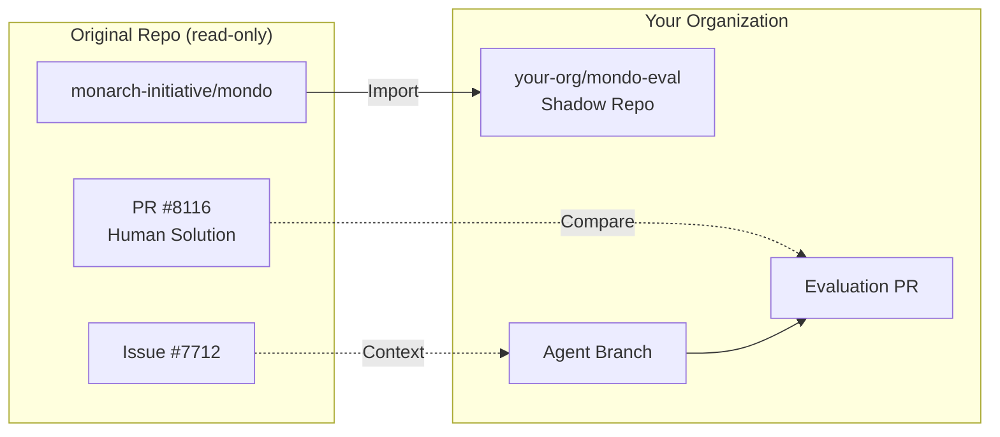

# Shadow repo evaluation

This tutorial walks you through setting up and running AI agent evaluations using shadow repositories. By the end, you'll have a complete evaluation pipeline running via GitHub Actions.

## What you'll learn

- What shadow repositories are and why they're useful
- How to set up a shadow repo for evaluation
- Creating agent configuration templates
- Running evaluations via GitHub Actions
- Comparing agent solutions to human solutions

## Prerequisites

- [SCRIBE installed](installation.md)
- A GitHub organization where you can create repositories
- Access to create GitHub Actions workflows
- An Anthropic API key or Claude Code OAuth token

## Concept: Why shadow repos?

When evaluating AI coding agents, you want to:

1. **Test on real issues** with known solutions (merged PRs)
2. **Start from the exact same state** as the human developer
3. **Keep the original repository clean** (no experiment branches cluttering it)
4. **Run many experiments** with different agent configurations

Shadow repositories solve all of these by creating a copy of the original repository in your organization. The agent works on the shadow repo while referencing issues from the original.



## Step 1: Import the target repository

Use GitHub's import feature to create a shadow copy:

1. Go to [github.com/new/import](https://github.com/new/import)
2. Enter the original repository URL (e.g., `https://github.com/monarch-initiative/mondo`)
3. Choose your organization as the owner
4. Name it descriptively (e.g., `mondo-eval`)
5. Set visibility (private is fine for evaluations)
6. Click "Begin import"

!!! note "Import preserves commit history"
    GitHub import preserves commit SHAs, which is essential. When SCRIBE resets
    to the base commit of the original PR, that exact commit exists in your shadow repo.

## Step 2: Add the evaluation workflow

Copy the evaluation workflow to your shadow repository:

```bash
# Clone your shadow repo
git clone https://github.com/your-org/mondo-eval.git
cd mondo-eval

# Create the workflows directory
mkdir -p .github/workflows

# Download the evaluation workflow
curl -o .github/workflows/eval-agent-on-issue.yml \
  https://raw.githubusercontent.com/ai4curation/ai4c-scribe/main/workflows/eval-agent-on-issue.yml

# Commit and push
git add .github/workflows/
git commit -m "Add agent evaluation workflow"
git push
```

## Step 3: Configure repository secrets

Go to your shadow repo's Settings → Secrets and variables → Actions, and add:

| Secret | Required | Description |
|--------|----------|-------------|
| `ANTHROPIC_API_KEY` | Yes* | Your Anthropic API key |
| `CLAUDE_CODE_OAUTH_TOKEN` | Yes* | Alternative: Claude Code OAuth token |
| `GH_PAT` | Maybe | Personal Access Token (only if accessing private repos across orgs) |

*At least one of `ANTHROPIC_API_KEY` or `CLAUDE_CODE_OAUTH_TOKEN` is required.

## Step 4: Create an agent configuration

Agent configurations tell Claude Code how to approach tasks in your repository. Create a new repo for your agent config:

```bash
# Create agent config repo
mkdir mondo-agent && cd mondo-agent
git init

# Create the structure
mkdir -p template

# Create the justfile (required)
cat > justfile << 'EOF'
AGENT_FILES := "CLAUDE.md AGENTS.md .goosehints .claude"

[no-cd]
pre_clean target-directory=".":
    cd {{target-directory}} && rm -rf {{AGENT_FILES}}

[no-cd]
install target-directory=".": (pre_clean target-directory)
    copier copy -f {{ justfile_directory() }}/template {{ target-directory }}
EOF

# Create copier.yaml
cat > copier.yaml << 'EOF'
_tasks:
  - echo "Agent config installed"
EOF

# Create the CLAUDE.md with agent instructions
cat > template/CLAUDE.md << 'EOF'
# Agent Instructions

You are solving issues in the Mondo disease ontology repository.

## How to Read Issue Context

The file `__issue_context__.json` contains:
- Issue title and body
- All comments made before the PR was created
- The issue URL for reference

## Repository Guidelines

1. **Follow existing patterns**: Look at similar files before making changes
2. **Make minimal changes**: Only modify what's necessary to fix the issue
3. **Test your work**: Run `make test` if available
4. **Commit clearly**: Write descriptive commit messages

## Domain Knowledge

- Mondo uses the MONDO: prefix for disease terms
- Edits are typically made in `src/ontology/` files
- Use ROBOT templates for batch changes when appropriate
EOF

# Commit and push
git add .
git commit -m "Initial agent configuration"
git remote add origin https://github.com/your-org/mondo-agent.git
git push -u origin main

# Tag for versioning
git tag v1.0.0
git push origin v1.0.0
```

## Step 5: Find test issues

Use SCRIBE to find issues with known solutions:

```bash
# Extract PRs with 1-to-1 issue mappings
ai4c-scribe extract monarch-initiative/mondo \
  -o mondo-prs.jsonl \
  --one-to-one-only \
  -l 50

# Find good candidates (issues with clear descriptions)
cat mondo-prs.jsonl | jq -r 'select(.category == "merged_with_mods") |
  "Issue: \(.issues.linked_issues[0]) → PR: \(.pr_number) (\(.metadata.title))"'
```

Look for issues that:

- Have clear descriptions of what needs to be done
- Were successfully merged (proven solutions)
- Have reasonable scope (not massive refactors)

## Step 6: Run your first evaluation

Via GitHub CLI:

```bash
gh workflow run eval-agent-on-issue \
  --repo your-org/mondo-eval \
  --field issue_repo=monarch-initiative/mondo \
  --field issue_number=7712 \
  --field pr_number=8116 \
  --field agent_config_repo=your-org/mondo-agent \
  --field agent_config_tag=v1.0.0 \
  --field model=claude-sonnet-4-5-20250929 \
  --field create_pr=true
```

Or via the GitHub Actions UI:

1. Go to your shadow repo → Actions → "Evaluate an agent on an issue"
2. Click "Run workflow"
3. Fill in the parameters
4. Click "Run workflow"

## Step 7: Monitor the evaluation

Watch the workflow progress:

```bash
# List recent workflow runs
gh run list --repo your-org/mondo-eval --workflow=eval-agent-on-issue.yml

# Watch a specific run
gh run watch <run-id> --repo your-org/mondo-eval
```

The workflow will:

1. Checkout at the PR's base commit (the state before the human's PR)
2. Apply your agent configuration
3. Run Claude Code with the issue context
4. Create an evaluation PR with the agent's solution

## Step 8: Compare results

Once the evaluation completes, you'll have:

- **Agent branch**: `scribe-v1-...-issue-7712`
- **Evaluation PR**: Targeting `eval-base-issue-7712`
- **Artifacts**: Claude execution trace

Compare the agent's solution to the human's:

```bash
# Fetch both solutions
git fetch origin
git fetch https://github.com/monarch-initiative/mondo.git refs/pull/8116/head:human-solution

# Compare the diffs
git diff eval-base-issue-7712..scribe-v1-...-issue-7712 > agent.diff
git diff <base-commit>..human-solution > human.diff

# Use SCRIBE's metadiff to compare
ai4c-scribe metadiff compare human.diff agent.diff -c obo
```

## Step 9: Iterate on your agent

Based on results, improve your agent configuration:

1. **Update CLAUDE.md** with better instructions
2. **Tag a new version** (`v1.1.0`)
3. **Run the same evaluation** with the new config
4. **Compare improvement** across iterations

Track iterations using the `iter_num` parameter:

```bash
gh workflow run eval-agent-on-issue \
  --repo your-org/mondo-eval \
  --field issue_number=7712 \
  --field pr_number=8116 \
  --field agent_config_tag=v1.1.0 \
  --field iter_num=2 \
  ...
```

## What you've learned

- Shadow repositories enable clean, reproducible agent evaluation
- Agent configurations (CLAUDE.md) guide Claude Code's behavior
- The evaluation workflow resets to historical commit states
- Metadiff helps compare agent vs human solutions
- Versioning and iteration tracking enable systematic improvement

## What's next?

- [How-to: Set up shadow repos](../how-to/shadow-repos.md): More configuration options
- [Explanation: Shadow repos](../explanation/shadow-repos.md): Design rationale
- [Reference: GitHub workflows](../reference/github-workflows.md): Full workflow documentation
