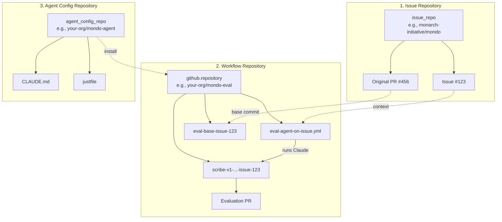
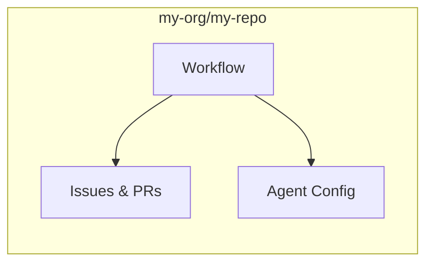
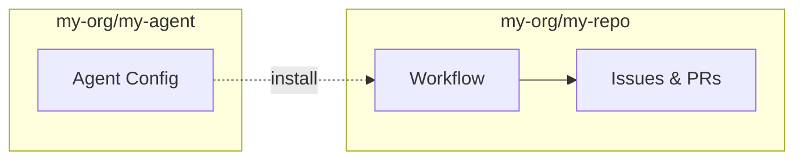
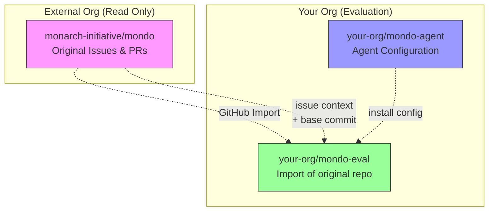
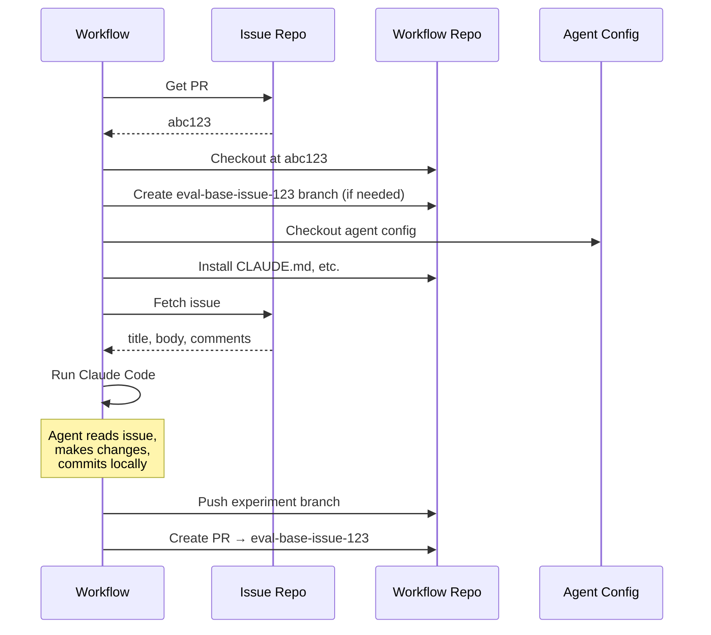
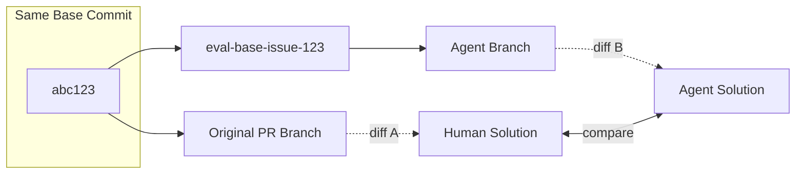

# Workflow Templates

This directory contains reusable GitHub Actions workflow templates for evaluating AI coding agents.

## eval-agent-on-issue.yml

Evaluates an AI agent's ability to solve a GitHub issue by simulating the conditions when the original PR was created.

### Understanding the Repository Architecture

The workflow can involve up to **three different repositories**, each serving a distinct purpose:



#### The Three Repos Explained

| Repository | Purpose | Example |
|------------|---------|---------|
| **Issue Repo** (`issue_repo`) | Source of the issue/PR being evaluated. Contains the original problem and human solution. | `monarch-initiative/mondo` |
| **Workflow Repo** (`github.repository`) | Where the workflow runs and agent makes changes. This is where branches and eval PRs are created. | `your-org/mondo-eval` |
| **Agent Config Repo** (`agent_config_repo`) | Contains agent instructions (CLAUDE.md), configuration, and install scripts. | `your-org/mondo-agent` |

### Deployment Scenarios

#### Scenario 1: Simple (Single Repo)

All three repos are the same. Good for quick testing.



```bash
gh workflow run eval-agent-on-issue \
  --field issue_number=123 \
  --field pr_number=456 \
  --field agent_config_tag=main \
  --field model=claude-sonnet-4-5-20250929
```

#### Scenario 2: Separate Agent Config

Issue repo and workflow repo are the same, but agent config is separate. Good for reusable agent configurations.



```bash
gh workflow run eval-agent-on-issue \
  --field issue_number=123 \
  --field pr_number=456 \
  --field agent_config_repo=my-org/my-agent \
  --field agent_config_tag=v1.0.0 \
  --field model=claude-sonnet-4-5-20250929
```

#### Scenario 3: Full Separation (Recommended for Production)

All three repos are different. **Recommended** because:

- **Avoids polluting the original repo** with evaluation branches and PRs
- Keeps evaluation artifacts separate from production
- Allows testing agents on repos you don't own
- Enables private evaluation of public repos



**Setup for Scenario 3:**

1. **Import the original repo** using GitHub's import feature:
   - Go to https://github.com/new/import
   - Enter the original repo URL
   - This creates a copy with the same commit history

2. **Add the workflow** to your imported repo:
   ```bash
   cp workflows/eval-agent-on-issue.yml your-imported-repo/.github/workflows/
   ```

3. **Run evaluations** pointing to the original repo for context:
   ```bash
   gh workflow run eval-agent-on-issue \
     --repo your-org/mondo-eval \
     --field issue_repo=monarch-initiative/mondo \
     --field issue_number=123 \
     --field pr_number=456 \
     --field agent_config_repo=your-org/mondo-agent \
     --field agent_config_tag=v1.0.0 \
     --field model=claude-sonnet-4-5-20250929 \
     --field create_pr=true
   ```

**Why import works:** GitHub import preserves commit SHAs. When the workflow checks out at the PR's base commit (from the original repo), that same commit exists in your imported repo. The agent works on your copy, keeping the original pristine.

**⚠️ Important:** If accessing **private repos across organizations**, you **must** use `GH_PAT`. The default `GITHUB_TOKEN` cannot access private repos outside the current repository's organization context.

### How It Works



1. **Rewinds history**: Checks out the repository at the exact commit when the original PR was created
2. **Creates eval-base branch**: `eval-base-issue-{N}` serves as the merge target (not `main`)
3. **Applies agent config**: Installs agent instructions (CLAUDE.md, etc.) from a template repo
4. **Runs Claude Code**: Agent reads the issue and attempts to solve it
5. **Creates evaluation PR**: Targets the eval-base branch with `[DO NOT MERGE]` prefix

This approach allows clean comparisons between agent outputs and original PRs, without conflicts from subsequent changes to `main`.

### Setup

1. **Copy to your repo**:
   ```bash
   cp workflows/eval-agent-on-issue.yml your-repo/.github/workflows/
   ```

2. **Configure secrets** (Settings → Secrets and variables → Actions):

   | Secret | Required | Description |
   |--------|----------|-------------|
   | `ANTHROPIC_API_KEY` | One of these | Anthropic API key |
   | `CLAUDE_CODE_OAUTH_TOKEN` | One of these | Claude Code OAuth token |
   | `GH_PAT` | Optional | Personal Access Token with `repo` scope (only for cross-repo private access) |

   **Note on permissions:** The workflow requires `contents: write` and `pull-requests: write` because it pushes branches and optionally creates PRs. These are set in the workflow file itself.

3. **Update `SCRIBE_VERSION`** in the workflow file when making breaking changes to your evaluation methodology.

#### Setting up GH_PAT (for cross-repo access)

If you're accessing private repos across organizations (Scenario 3), you need a Personal Access Token:

**Create or manage tokens:**
- Fine-grained (recommended): https://github.com/settings/personal-access-tokens
- Classic: https://github.com/settings/tokens

**Required permissions (fine-grained):**

| Permission | Access | Why |
|------------|--------|-----|
| **Contents** | Read and write | Checkout repos, push branches |
| **Pull requests** | Read and write | Create evaluation PRs |
| **Metadata** | Read | Required for all tokens |

Select the specific repositories the token needs access to (issue repo, agent config repo).

**Required scopes (classic):**
- `repo` (covers everything)

**Updating existing tokens:**
- Fine-grained: Click token → Edit → add repos/permissions → Update
- Classic: Cannot edit scopes; must regenerate

**Add to repository secrets:**
```bash
gh secret set GH_PAT --repo your-org/your-eval-repo
# Paste token when prompted
```

### Usage

#### Via GitHub UI

Actions → Evaluate an agent on an issue → Run workflow → Fill in parameters

#### Via CLI

```bash
gh workflow run eval-agent-on-issue \
  --field issue_repo=monarch-initiative/mondo \
  --field issue_number=1234 \
  --field pr_number=5678 \
  --field agent_config_repo=obophenotype/mondo-agent \
  --field agent_config_tag=v1.0.0 \
  --field model=claude-sonnet-4-5-20250929 \
  --field create_pr=true
```

### Inputs

| Input | Required | Description |
|-------|----------|-------------|
| `issue_repo` | No | Repository containing the issue (defaults to current repo) |
| `issue_number` | Yes | Issue number to solve |
| `pr_number` | Yes | Original PR number (used to determine base commit) |
| `agent_config_repo` | No | Repository containing agent config (defaults to current repo) |
| `agent_config_tag` | Yes | Tag/branch of agent config repo |
| `agent_config_directory` | No | Directory within config repo (default: `.`) |
| `model` | Yes | Claude model (dropdown with current and legacy options) |
| `force_new_branch` | No | Force push if branch exists (default: `false`) |
| `create_pr` | No | Create a PR after agent runs (default: `false`) |
| `iter_num` | No | Iteration number for multiple runs of same config (default: `1`) |

### Available Models

**Current (4.5):**
- `claude-sonnet-4-5-20250929`
- `claude-haiku-4-5-20251001`
- `claude-opus-4-5-20251101`

**Legacy (4.x):**
- `claude-opus-4-1-20250805`
- `claude-sonnet-4-20250514`
- `claude-opus-4-20250514`

**Legacy (3.x):**
- `claude-3-7-sonnet-20250219`
- `claude-3-haiku-20240307`

### Branch Naming

The workflow creates branches with this pattern:
```
scribe-{VERSION}-{agent_config_repo}-{tag}-{directory}-{model}-iter{N}-issue-{N}
```

Example: `scribe-v1-cmungall-pr-apprentice-preview-main-.-claude-sonnet-4-5-20250929-iter1-issue-10`

### Authoring Agent Config Templates

An agent config template provides the instructions and context that Claude Code uses when solving issues. The template is applied to the target repository before the agent runs.

#### Template Structure

```
my-agent-config/
├── justfile              # Required: must have an `install` recipe
├── copier.yaml           # Optional: copier configuration
└── template/             # Files to copy into the target repo
    ├── CLAUDE.md         # Agent instructions (read by Claude Code)
    ├── AGENTS.md         # Optional: additional agent context
    └── .claude/          # Optional: Claude Code settings
        └── settings.json
```

#### Required: justfile with `install` recipe

The workflow calls `just -f <template>/justfile install` to apply your template. The justfile must:

1. Clean up any existing agent files (to avoid conflicts)
2. Copy your template files into the target directory

```just
# List of agent instruction files to manage
AGENT_FILES := "CLAUDE.md AGENTS.md .goosehints .github/copilot-instructions.md .claude .codex"

# Remove existing agent instructions from the target directory
[no-cd]
pre_clean target-directory=".":
    cd {{target-directory}} && rm -rf {{AGENT_FILES}}

# Install the template into the target directory
[no-cd]
install target-directory=".": (pre_clean target-directory)
    copier copy -f {{ justfile_directory() }}/template {{ target-directory }}
```

**Key points:**
- Use `[no-cd]` attribute so recipes run in the caller's directory, not the justfile's directory
- `{{ justfile_directory() }}` refers to where the justfile lives (your template repo)
- The `install` recipe takes an optional `target-directory` argument (defaults to `.`)

#### Optional: copier.yaml

If you use [copier](https://copier.readthedocs.io/) for templating, add a `copier.yaml`:

```yaml
_tasks:
  - echo "Template applied successfully"
```

Copier allows Jinja2 templating in your files, but for most agent configs a simple file copy suffices.

#### Writing CLAUDE.md

The `CLAUDE.md` file is the primary way to instruct Claude Code. Include:

1. **Task context**: Explain what the agent should do
2. **Repository-specific rules**: Coding conventions, test requirements
3. **Domain knowledge**: Ontology terms, data formats, project architecture

Example `template/CLAUDE.md`:

```markdown
# Agent Instructions

You are solving issues in the Mondo disease ontology repository.

## Task Guidelines

1. Read the issue context from `__issue_context__.json`
2. Understand what changes are requested
3. Make the necessary code changes
4. Commit with a clear message describing what was done

## Repository-Specific Rules

- Follow OBO Foundry conventions for ontology edits
- Use ROBOT templates for batch changes
- Run `make test` before committing
- Keep changes minimal and focused on the issue

## Domain Knowledge

- Mondo uses the MONDO: prefix for terms
- Cross-references should use exact match (skos:exactMatch)
- New terms require a definition and at least one synonym
```

#### Template Versioning

Use git tags to version your templates:

```bash
git tag v1.0.0
git push origin v1.0.0
```

Then reference by tag in the workflow:
```
agent_config_tag: v1.0.0
```

This ensures reproducible experiments - avoid using `main` or `latest` for production evaluations.

#### Subdirectory Templates

You can have multiple templates in one repo using `agent_config_directory`:

```
my-agent-configs/
├── mondo-agent/
│   ├── justfile
│   └── template/
├── uberon-agent/
│   ├── justfile
│   └── template/
└── generic-ontology-agent/
    ├── justfile
    └── template/
```

Reference with:
```
agent_config_repo: my-org/my-agent-configs
agent_config_directory: mondo-agent
```

#### Example: test-template/

See `test-template/` in this repository for a minimal working example:

```
test-template/
├── justfile          # install recipe using copier
├── copier.yaml       # minimal copier config
└── template/
    └── CLAUDE.md     # basic agent instructions
```

### Outputs

- **Branch**: Always created with experiment metadata in commit message
- **PR** (optional): Targets `eval-base-issue-{N}` with `[DO NOT MERGE]` prefix
- **Artifact**: Claude execution trace (`claude-response-{run_id}`)

### Known Limitations

#### Branch Existence Check

The workflow checks for existing branches using `git rev-parse --verify`, which only checks **local** refs. If a branch exists on the remote but not locally:

- With `force_new_branch=false`: The local check passes, but `git push` will fail with "branch already exists on remote". This is the correct behavior (don't overwrite), just with a less clear error message.
- With `force_new_branch=true`: The force push handles this correctly, overwriting the remote branch.

This is a minor UX issue, not a correctness bug. The current behavior errs on the side of caution.

### Comparing Results

To compare agent output with original PR:



1. Agent's changes are on `scribe-v1-...-issue-{N}`
2. Original PR's changes are in `__pr_result__/` during workflow (and on the original PR)
3. Both branch from the same base commit, enabling clean diff comparison
